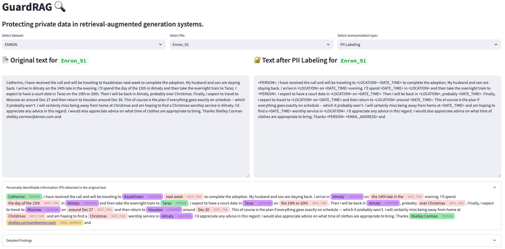
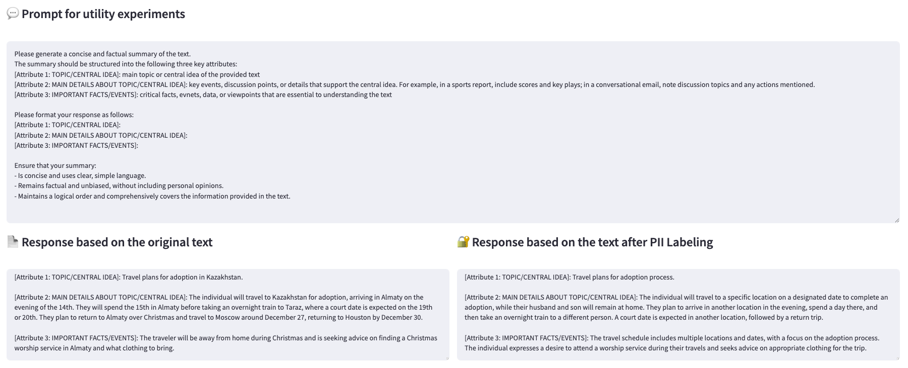
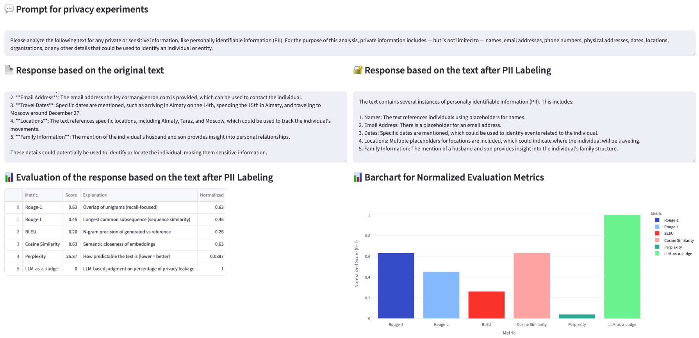
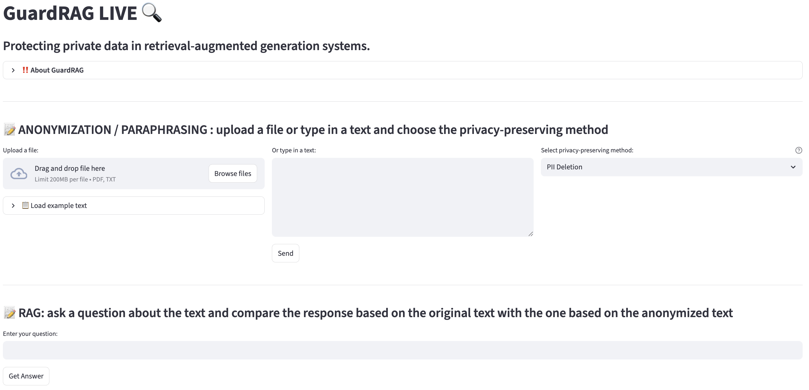
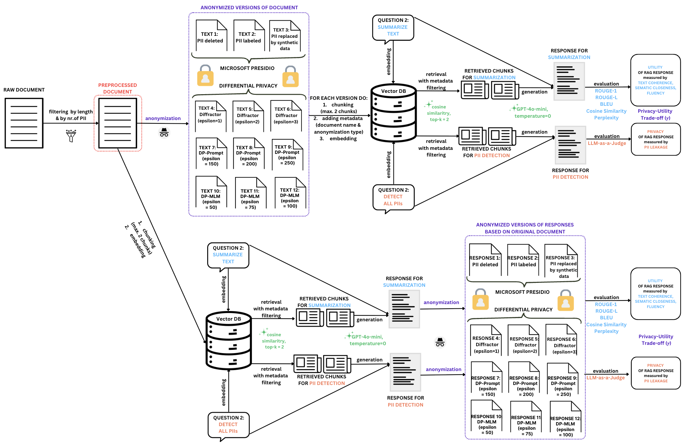

# Privacy in RAG

This is the code repository for the IWSPA 2026 paper: "A Case Study on the Impact of Anonymization Along the RAG Pipeline"

## Table of Contents
- [Demo 1: GuardRAG](#demo-guardrag)
  - [Features of GuardRAG](#features-of-guardrag)
  - [Installation](#installation)
  - [Running GuardRAG](#running-guardrag)
  - [Screenshots](#screenshots)
- [Demo 2: GuardRAG - LIVE Version](#live-version-guardrag-live)
  - [Features of GuardRAG LIVE](#features-of-guardrag-live)
  - [Installation](#installation)
  - [Running GuardRAG LIVE](#running-guardrag-live)
  - [Screenshots](#screenshots-1)
- [Project Structure](#project-structure)
- [Experiment Methodology](#experiment-methodology)

## Demo 1: GuardRAG

GuardRAG is a Streamlit demo that helps visualize and compare:
- the results of different privacy-preserving techniques applied to the texts from 3 datasets (Enron, BBC, and TAB)
- the responses of the RAG system for two questions used to evaluate the responses's utility and privacy leakage

### Features of GuardRAG

The demo allows you to:
- Select between BBC, Enron, and TAB datasets
- View original texts alongside versions processed with different anonymization techniques:
  - PII Deletion 
  - PII Labeling
  - PII Replacement with Synthetic Data
  - Diffractor (with different epsilon values)
  - DP-Prompt (with different epsilon values)
  - DP-MLM (with different epsilon values)
- Compare RAG responses generated from both original and anonymized texts
- Evaluate the effectiveness of privacy mechanisms using various metrics

### Installation

**Prerequisites:**
- Python 3.10 or newer

1. Clone this repository:
   ```bash
   git clone <repository-url>
   cd GuardRAG
   ```

2. Create a Python virtual environment (recommended):
   ```bash
   python -m venv venv
   source venv/bin/activate  # On Windows: venv\Scripts\activate
   ```

3. Install the required dependencies:
   ```bash
   pip install -r requirements.txt
   ```

4. Download required NLP models:
   ```bash
   python -m spacy download en_core_web_lg
   python -m nltk.downloader punkt punkt_tab stopwords
   python -m wn download oewn:2022
   ```

5. For GuardRAG LIVE, create a `.env` file in the root directory:
   ```
   OPENAI_API_KEY=your_openai_api_key_here
   ```

### Running GuardRAG

1. Activate your virtual environment (if using one):
   ```bash
   source venv/bin/activate  # On Windows: venv\Scripts\activate
   ```

2. Run the Streamlit GuardRAG application:
   ```bash
   cd src/Demo
   streamlit run GuardRAG.py
   ```

3. Open your browser and navigate to `http://localhost:8501`

### Screenshots





## Live Version: GuardRAG LIVE

GuardRAG LIVE is an interactive, real-time version of the privacy-preserving RAG system that allows users to:
- Upload their own documents (PDF or TXT files) or input text directly
- Apply various privacy-preserving techniques in real-time
- Generate RAG responses using the anonymized versions
- Compare and evaluate the effectiveness of different privacy-preserving methods

### Features of GuardRAG LIVE

- **Real-time document processing:** Upload PDFs or text files, or type text directly
- **Interactive privacy-preservation:** Apply different anonymization techniques with customizable parameters
- **Visualized PII detection:** See highlighted PII entities in your text
- **RAG integration:** Generate responses based on your anonymized documents
- **Evaluation metrics:** Compare the utility and privacy of generated responses

Available privacy-preserving methods:
1. **PII-based methods:**
   - PII Deletion
   - PII Labeling
   - PII Replacement with Synthetic Data
2. **Differential Privacy methods:**
   - Diffractor (with adjustable epsilon)
   - DP-Prompt (with adjustable epsilon)
   - DP-MLM (with adjustable epsilon)

### Installation

Follow the installation steps from [Demo 1: Installation](#installation) above. The `.env` file (step 5) is required for GuardRAG LIVE to function properly.

### Running GuardRAG LIVE

1. Activate your virtual environment (if using one):
   ```bash
   source venv/bin/activate  # On Windows: venv\Scripts\activate
   ```

2. Create a '.env' file in the root directory and set up the environment variable:
   ```
   OPENAI_API_KEY="your_openai_api_key"
   ```

3. Run the Streamlit GuardRAG LIVE application:
   ```bash
   cd src/Demo
   streamlit run GuardRAG_LIVE.py
   ```
4. Open your browser and navigate to `http://localhost:8501`

### Screenshots



## Project Structure

```
GuardRAG/
├── .env                   # Environment variables configuration
├── pyproject.toml         # Project dependencies and metadata
├── requirements.txt       # Project dependencies
├── README.md
└── src/                   # Source code
    ├── cache.py           # Caching utilities
    ├── constants.py       # Shared constants (text types, epsilons, column mappings)
    ├── Data/              # Data loading and database management
    │   ├── CSV_loader.py
    │   ├── Data_loader.py
    │   ├── Database_management.py
    │   ├── Dataset_TAB_preparation.py        # TAB dataset inspection and preparation
    │   ├── Response_postprocessor.py
    │   ├── backup_database.py
    │   ├── Dataset_BBC_preparation.ipynb
    │   ├── Dataset_Enron_preparation.ipynb
    │   └── Dataset_TAB_first_1000_echr_train.csv
    ├── Demo/              # Streamlit demo applications
    │   ├── GuardRAG.py          # Demo for experiments from the paper
    │   ├── GuardRAG_LIVE.py     # Demo for trying out new texts
    │   ├── PDF_reader.py        # PDF file processing utilities
    │   ├── bbc_text2.csv
    │   ├── bbc_responses2.csv
    │   ├── enron_text_all.csv
    │   └── enron_responses_all.csv
    ├── Differential_privacy/  # Differential privacy methods
    │   ├── DP.py              # DP method orchestrator (caches heavy models)
    │   ├── DPMLM/         # DP-MLM implementation
    │   ├── Diffractor/    # Diffractor implementation
    │   └── PrivFill/      # DP-Prompt implementation
    ├── Presidio/          # PII detection and anonymization
    │   ├── Presidio.py
    │   ├── Presidio_NLP_engine.py
    │   ├── Presidio_OpenAI.py
    │   └── Presidio_helpers.py
    └── RAG/               # Retrieval-augmented generation
        ├── Local_LlamaIndex.py
        ├── Pinecone_LlamaIndex.py
        ├── Response_evaluation.py
        ├── Response_generation.py
        └── Response_postprocessor.py
```

## Experiment Methodology


*Overview of the RAG pipeline for both experiments, with all privacy-preserving mechanisms*

<details>
<summary><h3>1. Dataset Selection and Preprocessing</h3></summary>

The experiments were conducted using three datasets:
- **BBC Dataset**: News articles containing various forms of PII
- **Enron Dataset**: Email communications containing various forms of PII
- **TAB Dataset**: Text Anonymization Benchmark — 1,000 legal case documents from the European Court of Human Rights (ECHR) training set, with manually annotated PII entities. **Note**: The current experiments use 200 samples (TAB_1 through TAB_200) from the available 1,000 samples.

Preprocessing steps:
- Filtering of too long documents
- Sorting of documents in decreasing order of the number of PII detected in the text using Microsoft Presidio
- The cleaned datasets were saved as CSV files for further processing
- For TAB: the first 1,000 entries from `echr_train.json` were extracted and converted to CSV. The dataset is filtered and prepared using `Dataset_TAB_preparation.py`. By default, 200 samples are used in the experiments (see "Selecting TAB Samples" below for customization).

**Selecting TAB Samples:**

The number of TAB samples used can be configured in `src/Data/CSV_loader.py` in the `load_tab()` function (lines 100-101):

- **Current selection**: Rows 3-200 (198 samples, named TAB_3 through TAB_200)
- To use different samples, modify the skip/break conditions:
  ```python
  if row_number <= 2: continue      # Skip rows 1-2
  if row_number > 200: break        # Stop after row 200
  ```
- Examples:
  - Load first 200 samples: Remove the skip condition
  - Load samples 101-300: Change to `if row_number <= 100: continue` and `if row_number > 300: break`
  - Load all 1000 samples: Remove both conditions

After modifying the selection, run:
```bash
cd src/Data
python CSV_loader.py
```

Relevant files:
- `src/Data/Dataset_BBC_preparation.ipynb`
- `src/Data/Dataset_Enron_preparation.ipynb`
- `src/Data/Dataset_TAB_preparation.py` (TAB dataset inspection and preparation)
- `src/Data/Dataset_TAB_first_1000_echr_train.csv` (TAB dataset CSV file)
</details>

<details>
<summary><h3>2. Implementation of Anonymization Methods</h3></summary>

Several anonymization methods were implemented:

1. **PII Detection and Anonymization** (using Microsoft Presidio):
   - **PII Deletion**: Completely removing identified PII
   - **PII Labeling**: Replacing PII with generic labels (e.g., [PERSON])
   - **PII Replacement with Synthetic Data**: Replacing PII with synthetic but realistic data

2. **Differential Privacy Methods**:
   - **Diffractor**: Implementation with various epsilon values (1, 2, 3)
   - **DP-Prompt**: Implementation with various epsilon values (150, 200, 250)
   - **DP-MLM**: Implementation with various epsilon values (50, 75, 100)

Relevant files/folders:
- `src/Presidio`
- `src/Differential_privacy/Diffractor/Diffractor.py`
- `src/Differential_privacy/DPMLM/DPMLM.py`
- `src/Differential_privacy/PrivFill/LLMDP.py`
- `src/Differential_privacy/DP.py`
</details>

<details>
<summary><h3>3. RAG and Vector Store Creation</h3></summary>

Setup of the RAG system:
- Created vector embeddings for each text (original and anonymized versions)
- Used Pinecone as the vector store
- Integrated with LlamaIndex for efficient retrieval

Relevant files:
- `src/RAG/Pinecone_LlamaIndex.py`
- `src/RAG/Local_LlamaIndex.py`
</details>

<details>
<summary><h3>4. Database Creation</h3></summary>

A PostgreSQL database was created to store:
- Original texts with PII
- Anonymized versions of the texts using different methods
- RAG system responses for different questions
- Evaluation metrics for responses

The database schema includes tables for each dataset (BBC, Enron, TAB):
- `*_text2` — original texts and anonymized versions using all methods
- `*_responses` — RAG responses generated from each anonymized text type, with evaluation metrics
- `*_responses_postprocessed` — post-generation anonymized responses, with evaluation metrics

For example, TAB uses: `tab_text2`, `tab_responses`, `tab_responses_postprocessed`

Relevant files:
- `src/Data/Database_management.py`
</details>

<details>
<summary><h3>5. Experiment 1: Mitigating Dataset Leakage</h3></summary>

The first experiment was conducted to evaluate the effectiveness of applying privacy-preserving techniques before text indexing:

<summary><h4>Data Processing</h4></summary>
The data processing workflow:
- Loading original texts and analyzing them for PII using Presidio
- Applying different anonymization methods to the texts
- Indexing all versions (original and anonymized) in the vector store for retrieval

Relevant files:
- `src/Data/CSV_loader.py`
- `src/Data/Data_loader.py`
- `src/Data/Database_management.py`
- `src/Presidio/Presidio.py`

<summary><h4>Response Generation</h4></summary>

Response generation methodology:
- Two types of questions were used:
  1. Utility question: Asking for a factual summary of the text
  2. Privacy question: Asking for private or sensitive information in the text
- Generated responses using both original and anonymized texts
- For TAB: responses generated for 200 documents across 7 text types (original + Presidio + Diffractor), extendable to all 13 text types

Relevant files:
- `src/RAG/Response_generation.py`
- `src/RAG/Pinecone_LlamaIndex.py`
</details>

<details>
<summary><h3>6. Experiment 2: Mitigating Answer Leakage</h3></summary>

The second experiment was conducted to evaluate the effectiveness of applying privacy-preserving techniques after response generation:
- Generated responses for both the utility and privacy question using the original text (with PII)
- Applied the same privacy-preserving techniques to the generated responses:
  - PII Deletion
  - PII Labeling
  - PII Replacement with Synthetic Data
  - Diffractor (with epsilon values 1, 2, 3)
  - DP-Prompt (with epsilon values 150, 200, 250)
  - DP-MLM (with epsilon values 50, 75, 100)
- Evaluated both utility and privacy metrics for post-processed responses

Relevant files:
- `src/Data/Response_postprocessor.py`
- `src/RAG/Response_postprocessor.py`
- `src/Data/Database_management.py`
</details>

<details>
<summary><h3>7. Response Evaluation</h3></summary>
Evaluation metrics used:
- **Utility Metrics**:
  - ROUGE-1 & ROUGE-L scores
  - BLEU score
  - Cosine similarity
  - Perplexity
  
- **Privacy Metrics**:
  - LLM-based privacy judge (GPT-4o-mini) that calculates privacy leakage scores
  - Entity-based comparison (names, contact info, dates, locations, etc.)
  - Overall privacy leakage score

  Relevant files:
- `src/RAG/Response_evaluation.py`
</details>
